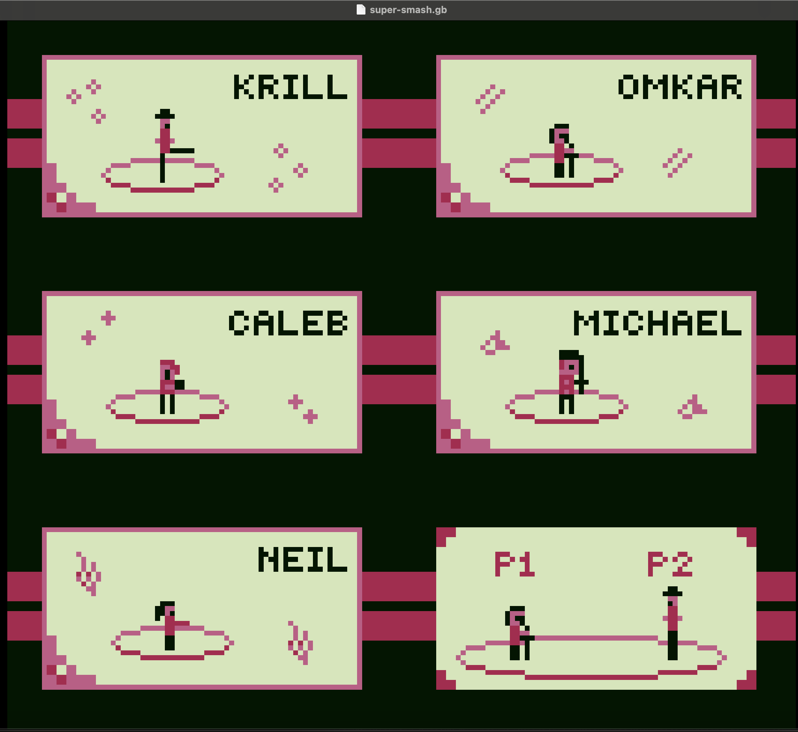

# super-smash-gb

Super Smash Bros adaptation featuring our TAs for CS429H, written in gameboy assembly.

## Setup

We recommend installing the [Sameboy](https://sameboy.github.io/downloads/) emulator, although any emulator with link-cable support should also work.

- Clone this repo and run the makefile (cd src && make)
- Select and open both super-smash.gb and super-smash-sub.gb in Sameboy
- Navigate to Connectivity > Game Link Cable & Infrared and select the other .gb file
    - The game is played in the super-smash.gb window
- Navigate to Emulation > Reset
- Configure controls for Player 1 and Player 2 in Sameboy Settings
    - A is attack, B is dash

Feel free to also change the palette colors in Sameboy Settings > Video

If you want to try facing off against our bot, you can skip the instructions above and just open super-smash-cpu.gb

## Gameplay

On the selection screen, use the left and right keys to select a character and press A to confirm your selection; Player 1 selects first. 

Each player has 3 lives and you lose a life if you are knocked off the screen. There is also a percentage indicator for each player at the bottom, with higher numbers corresponding to more knockback taken. 

